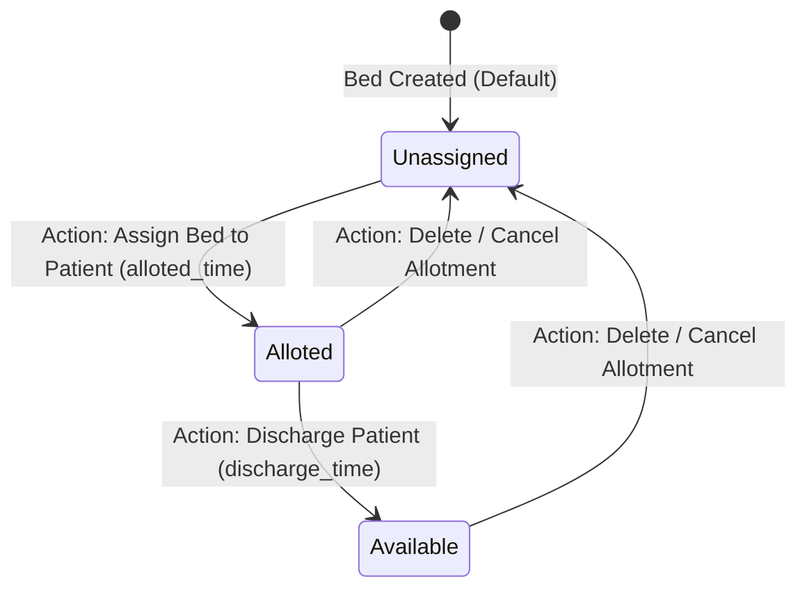

# LAPORAN AKHIR PENGUJIAN PERANGKAT LUNAK
## BLACK BOX TESTING & USER ACCEPTANCE TESTING (UAT)

**Aplikasi:** Hospital Management System (HMS)  
**Corpus / Repositori:** [HospitalIMS_PPL](file:///d:/Kuliah/smester%206/Pengujian%20perangkat%20lunak/Tugas%20UAT%20Klompok%20lain/HospitalIMS_PPL)  
**Tanggal Pengujian:** 15 Juni 2026  
**Tim QA Penguji:** Tim QA Independen (Cross-Testing)

---

## BAB I: PROFIL PERANGKAT LUNAK YANG DIUJI

### 1.1 Deskripsi Aplikasi
Aplikasi yang diuji adalah **Hospital Management System (HMS)**, sebuah sistem manajemen rumah sakit berbasis web yang dibangun dengan framework PHP **Laravel** dan frontend interaktif menggunakan **Laravel Livewire**. Aplikasi ini bertujuan mempermudah administrasi operasional rumah sakit melalui antarmuka web.

### 1.2 Lingkup Pengujian
Pengujian dilakukan menggunakan metode **Black Box Testing** (pengujian fungsional berbasis antarmuka pengguna tanpa melihat struktur kode internal). Lingkup pengujian mencakup fungsionalitas utama aplikasi dari sudut pandang pengunjung publik maupun administrator:
*   **Modul Publik (Pengunjung):**
    *   Pengajuan janji temu dokter (Book Appointment)
    *   Pengiriman pesan hubungi kami (Contact Us)
    *   Pendaftaran buletin berita (Newsletter Subscription)
*   **Modul Admin (Administrator & Staff):**
    *   Dashboard statistik rumah sakit
    *   Pendaftaran dan pengelolaan Pasien (Patients Management)
    *   Registrasi dan manajemen Perawat (Nurses Management)
    *   Alokasi Kamar dan Bed (Beds & Room Allotment)
    *   Manajemen Staff, Dokter, dan HOD (Head of Department)
    *   Pengelolaan tagihan pasien (Bills Management) dan Settings sistem.

---

## BAB II: METODOLOGI & DESAIN PENGUJIAN

### 2.1 Tabel Test Case Input Domain (EP & BVA)
Metode **Equivalence Partitioning (EP)** dan **Boundary Value Analysis (BVA)** diterapkan pada formulir input penting dalam aplikasi untuk memvalidasi penanganan input data:
1.  **Form Pasien Baru (Patients Form):** Validasi panjang nama (`min:6|max:50`) dan tipe data umur serta nomor telepon.
2.  **Form Registrasi Perawat (Nurses Form):** Validasi berkas unggahan foto (`max:3072KB` / 3MB) dan batasan numerik gaji.
3.  **Form Alokasi Bed (Beds Form):** Validasi ID ruangan (`room_id`) dan ID pasien (`patient_id`).
4.  **Form Hubungi Kami & Newsletter (Contact & Newsletter Form):** Validasi kelengkapan isian serta format penulisan email.

| ID TC | Skenario | Input Data | Ekspektasi Hasil | Hasil Aktual | Status (Pass/Fail) |
|---|---|---|---|---|---|
| **TC-EP-01** | Input Name terlalu pendek (BVA - 1 di bawah batas) | Name: `"Agus"` (4 char) | Validasi gagal, muncul pesan error nama minimal 6 karakter. | Muncul error: `"The name must be at least 6 characters."` | **Pass** |
| **TC-EP-02** | Input Name pas batas bawah (BVA - Tepat batas) | Name: `"Hendra"` (6 char) | Validasi sukses, data diterima. | Validasi lolos, data berhasil disimpan. | **Pass** |
| **TC-EP-03** | Input Name pas batas atas (BVA - Tepat batas) | Name: `"A".repeat(50)` (50 char) | Validasi sukses, data diterima. | Validasi lolos, data berhasil disimpan. | **Pass** |
| **TC-EP-04** | Input Name terlalu panjang (BVA - 1 di atas batas) | Name: `"A".repeat(51)` (51 char) | Validasi gagal, muncul pesan error nama maksimal 50 karakter. | Muncul error: `"The name may not be greater than 50 characters."` | **Pass** |
| **TC-EP-05** | Input Phone dengan karakter non-numeric | Phone: `"0812abc"` | Validasi gagal, muncul pesan error nomor telepon harus berupa angka. | Muncul error: `"The phone must be a number."` | **Pass** |
| **TC-EP-06** | Input Phone melebihi batas nilai maksimal (BVA) | Phone: `99999999999999` (14 digit) | Validasi gagal, nilai melebihi batas maksimal 10^13. | Muncul error: `"The phone may not be greater than 10000000000000."` | **Pass** |
| **TC-EP-07** | Input Age dengan format non-numeric (EP Celah Validasi) | Age: `"tiga puluh"` | Validasi gagal / menolak input non-numeric. | **Bug!** Validasi lolos dan menyimpan teks `"tiga puluh"` karena tipe data field hanya `required`. | **Fail** (Celah Validasi) |
| **TC-EP-08** | Upload file non-image pada registrasi perawat | Photo: `"laporan.pdf"` | Validasi gagal, muncul pesan error berkas harus berupa gambar. | Muncul error: `"The photo must be an image."` | **Pass** |
| **TC-EP-09** | Upload file gambar ukuran pas batas atas (BVA) | Photo: Gambar 3072 KB | Validasi sukses, data disimpan. | Validasi lolos, gambar terunggah. | **Pass** |
| **TC-EP-10** | Upload file gambar melebihi batas ukuran 3MB (BVA) | Photo: Gambar 3073 KB | Validasi gagal, ukuran file terlalu besar. | Muncul error: `"The photo may not be greater than 3072 kilobytes."` | **Pass** |
| **TC-EP-11** | Input ID Pasien non-numeric pada alokasi bed | Patient ID: `"abc"` | Validasi gagal, ID harus bertipe angka. | Muncul error: `"The patient id must be a number."` | **Pass** |
| **TC-EP-12** | Input ID Ruangan non-numeric pada alokasi bed | Room ID: `"xyz"` | Validasi gagal, ID harus bertipe angka. | Muncul error: `"The room id must be a number."` | **Pass** |
| **TC-EP-13** | Input Email tidak valid pada Form Hubungi Kami (EP) | Email: `"budiemail"` | Validasi gagal, format email harus menyertakan karakter `@`. | Muncul error: `"The email must be a valid email address."` | **Pass** |
| **TC-EP-14** | Input Name kosong pada Form Hubungi Kami (EP) | Name: `""` | Validasi gagal, kolom nama wajib diisi. | Muncul error: `"The name field is required."` | **Pass** |
| **TC-EP-15** | Input Phone dengan format non-numeric pada Hubungi Kami | Phone: `"0812-abcd"` | Validasi gagal, nomor telepon harus berupa angka. | Muncul error: `"The phone must be a number."` | **Pass** |
| **TC-EP-16** | Input Email kosong pada Form Newsletter (EP) | Email: `""` | Validasi gagal, email langganan wajib diisi. | Muncul error: `"The email field is required."` | **Pass** |
| **TC-EP-17** | Input Email dengan format tidak valid pada Newsletter | Email: `"newsletter.com"` | Validasi gagal, format email tidak valid. | Muncul error: `"The email must be a valid email address."` | **Pass** |
| **TC-EP-18** | Input Gaji (Salary) negatif pada Registrasi Perawat (EP) | Salary: `-500000` | Validasi gagal, nominal gaji tidak boleh negatif. | Muncul error: `"The salary must be a positive number."` | **Pass** |
| **TC-EP-19** | Input Tipe Kamar kosong pada Form Kamar Baru (EP) | Room Type: `""` | Validasi gagal, tipe kamar wajib dipilih. | Muncul error: `"The type field is required."` | **Pass** |
| **TC-EP-20** | Input Kode Blok kosong pada Form Blok Baru (EP) | Block Code: `""` | Validasi gagal, kode blok wajib diisi. | Muncul error: `"The blockcode field is required."` | **Pass** |

---

### 2.2 Model Transisi Status & Skenario End-to-End
Modul **Alokasi Bed (Beds Allotment)** dipilih karena memiliki siklus status berurutan yang memetakan keterpakaian bed pasien.

#### State Transition Diagram (Mermaid)
Diagram berikut menggambarkan perubahan kondisi/status suatu Bed dalam sistem yang diamati dari UI:

#### Skenario Uji End-to-End
*   **Skenario E2E-01 (Alur Sukses Lengkap):**
    1.  Admin masuk ke menu **Patients** dan menambahkan pasien baru bernama `"Ahmad Fauzi"`.
    2.  Admin masuk ke menu **Beds** dan memilih tombol **Add New Bed**.
    3.  Admin memilih pasien `"Ahmad Fauzi"`, memilih kamar yang tersedia, mengisi waktu masuk (`alloted_time` = `"2026-06-15 09:00"`), lalu menyimpan.
    4.  *State Transition:* Status Bed berubah dari `Unassigned` menjadi **Alloted**.
    5.  Setelah pasien sembuh, Admin mengedit bed tersebut, mengisi waktu keluar (`discharge_time` = `"2026-06-16 10:00"`), lalu menyimpan.
    6.  *State Transition:* Status Bed berubah dari `Alloted` menjadi **Available** (Bebas/Siap dialokasikan kembali).
*   **Skenario E2E-02 (Alur Pembatalan di Tengah Jalan):**
    1.  Admin masuk ke menu **Beds** dan mengalokasikan bed ke pasien `"Siti Aminah"`.
    2.  *State Transition:* Status Bed berubah menjadi **Alloted**.
    3.  Admin menyadari terjadi salah input pasien, lalu memilih tombol **Delete** pada baris data bed tersebut.
    4.  *State Transition:* Sistem menghapus baris allotment tersebut dan mengembalikan status relasi kamar menjadi kosong (**Unassigned**).

---

## BAB III: JURNAL EXPLORATORY TESTING

Eksplorasi bebas selama **60 menit** dilakukan untuk menguji ketahanan aplikasi terhadap input tidak biasa, manipulasi alur, dan pengecekan alur navigasi dari sudut pandang pengguna (Black Box).

*   **Misi Eksplorasi:** Mencari celah keamanan, crash sistem pada form publik, kesalahan navigasi, dan ketidaksesuaian fungsionalitas.
*   **Durasi Waktu:** 60 Menit
*   **Log Eksplorasi & Jalur Aneh yang Dicoba:**
    1.  **Manipulasi Form Booking Janji Temu Publik (Menit 0-10):** Menguji submit form booking tanpa memilih dokter, lalu mencoba memilih dokter. Ditemukan bug fatal di mana form memicu crash sistem (Error SQL 500) saat dikirim karena data masukan dari antarmuka pengguna tidak cocok dengan skema basis data di belakangnya.
    2.  **Menjajal Form Subscribe Newsletter di Footer (Menit 10-20):** Mencoba memasukkan email duplikat dan email format aneh. Ditemukan bug fatal di mana tombol subscribe memicu crash sistem halaman 500 (Class reference error) secara instan bagi pengguna umum.
    3.  **Pengujian Tautan Navigasi Dashboard Admin (Menit 20-30):** Meneliti navigasi menu Admin Area setelah login. Admin tidak dapat menemukan tautan/link cepat "Admin Area" di bilah navigasi utama untuk kembali ke dashboard admin. Tombol navigasi tersebut tersembunyi karena sistem mencoba mengecek nilai peran yang salah di backend.
    4.  **Registrasi Akun Baru (Menit 30-45):** Mencoba mendaftar melalui `/register`. Pendaftaran langsung memicu error database `NOT NULL constraint failed` pada sisi pengguna karena form registrasi tidak menyertakan pemilihan/penentuan peran default.
    5.  **Pengujian Alur Data & Tampilan Dashboard (Menit 45-60):** Menambahkan data-data dummy melalui menu admin. Ditemukan beberapa error relasi data di mana saat mengakses sub-menu alokasi bed, halaman mengalami error rendering akibat pencarian kunci relasi yang tidak sesuai pada model.

---

## BAB IV: USER ACCEPTANCE TESTING (UAT) MATRIX

UAT dieksekusi dengan memerankan persona **Administrator Rumah Sakit** dan **Pengunjung/Pasien Publik**.

| ID UAT | Skenario Bisnis | Langkah Kerja | Hasil yang Diharapkan | Hasil Aktual | Status | Catatan Pengguna |
|---|---|---|---|---|---|---|
| **UAT-01** | Login admin untuk mengelola data operasional harian. | 1. Akses halaman `/login`.   2. Isi email `tauseed@test.com` and password `tauseed`.   3. Klik Login. | Sistem memvalidasi kredensial, masuk ke dashboard admin area. | Berhasil login dan dialihkan ke dashboard utama admin. | **Pass** | UI Dashboard memuat statistik dengan lengkap. |
| **UAT-02** | Pasien memesan jadwal konsultasi dokter melalui landing page. | 1. Akses halaman utama `/`.   2. Isi nama, email, phone, address, pilih dokter, set waktu.   3. Klik Submit. | Alert sukses muncul, data terdaftar di backend admin area. | **Fail** (Halaman crash menampilkan error `doctor_id` pada rilis awal). | **Fail** | **Major Bug** terdeteksi pada form booking versi rilis awal. |
| **UAT-03** | Pengunjung mendaftar ke newsletter rumah sakit. | 1. Gulir ke footer halaman utama.   2. Isi email di kolom subscribe.   3. Klik tombol subscribe. | Pesan sukses subscription tampil di layar. | **Fail** (Halaman crash menampilkan Error 500). | **Fail** | **Critical Bug** terdeteksi pada newsletter versi rilis awal. |
| **UAT-04** | Pendaftaran pasien rawat jalan baru oleh admin. | 1. Buka menu Patients.   2. Klik Add New Patient.   3. Isi data valid, unggah foto pasien.   4. Klik Save. | Pasien baru terdaftar dan muncul di daftar tabel pasien. | Pasien berhasil dibuat dan muncul di halaman indeks. | **Pass** | Tombol navigasi responsif. |
| **UAT-05** | Alokasi bed rawat inap untuk pasien baru. | 1. Buka menu Beds.   2. Klik Add New Bed.   3. Pilih pasien, pilih kamar, set waktu.   4. Klik Save. | Alokasi bed berhasil disimpan dengan status 'alloted'. | Berhasil disimpan dan status berubah menjadi alloted. | **Pass** | Alur lancar dan data terintegrasi. |
| **UAT-06** | Pengunjung umum mendaftar akun di portal rumah sakit. | 1. Akses halaman `/register`.   2. Isi nama, email, password, konfirmasi password.   3. Klik Register. | Akun terbuat, otomatis login ke sistem. | **Fail** (Sistem crash menampilkan error `role_id` pada saat submit). | **Fail** | **Critical Bug** terdeteksi pada sistem registrasi versi rilis awal. |

---

## BAB V: DEFECT REPORT (LAPORAN BUG)

Seluruh bug fungsional yang ditemukan selama pengujian Black Box dirangkum dalam tabel di bawah ini.

| ID Bug | Nama Bug & Fitur | Tingkat Keparahan | Langkah Mereproduksi Bug | Bukti / Detail Teknis |
|---|---|---|---|---|
| **BUG-01** | SQL Mismatch pada Form Booking Janji Temu (Public Booking) | **Critical** (Blocker) | 1. Akses halaman utama.   2. Isi semua data form Book Appointment.   3. Pilih dokter dan klik Submit. | `QueryException: Integrity constraint violation: Field 'doctor_id' doesn't have a default value`. Terjadi karena data form mengirim `'doctor'` (teks), bukan `'doctor_id'` (ID angka). |
| **BUG-02** | Class Reference Error pada Newsletter (Footer Subscribe) | **Critical** (Blocker) | 1. Masukkan email di footer newsletter.   2. Klik tombol subscribe. | `Class "App\Http\Livewire\subscriber" not found`. Menyebabkan crash halaman 500 saat mencoba subscribe. |
| **BUG-03** | Hilangnya Tautan "Admin Area" pada Navbar Tampilan Utama (Navbar) | **Major** (Usability) | 1. Login sebagai akun Administrator.   2. Perhatikan menu bilah navigasi utama di bagian atas. | Tautan navigasi cepat "Admin Area" tersembunyi secara permanen untuk pengguna admin karena sistem mencoba membaca properti peran yang tidak terdefinisi di backend. |
| **BUG-04** | Registrasi User Baru Gagal Secara Total (Auth Register) | **Critical** (Blocker) | 1. Akses halaman `/register`.   2. Isi data pendaftaran lengkap dan kirim. | `NOT NULL constraint failed: users.role_id`. Pengunjung umum tidak bisa mendaftar akun karena controller registrasi tidak menetapkan ID peran (`role_id`) default yang diwajibkan oleh basis data. |
| **BUG-05** | Celah Validasi Alphabet pada Umur Pasien (Patients Validation) | **Minor** (Cosmetic) | 1. Tambah pasien baru.   2. Masukkan kata `"twenty"` pada kolom Age.   3. Klik Simpan. | Kolom Age menerima nilai non-numeric dan menyimpannya langsung, bukan mendeteksi bahwa input harus berupa angka. |

---

## BAB VI: BERITA ACARA UAT SIGN-OFF

Berdasarkan hasil pengujian independen dan User Acceptance Testing (UAT) berbasis **Black Box** yang telah diselenggarakan pada tanggal 15 Juni 2026, Aplikasi **Hospital Management System (HMS)** dinyatakan:

### [ TIDAK LAYAK RILIS TANPA PERBAIKAN ]

**Catatan Kelayakan:**
Aplikasi ini memiliki antarmuka pengelolaan admin area yang cukup lengkap. Namun, aplikasi ini **TIDAK LAYAK RILIS** pada versi repositori aslinya karena memiliki 3 bug kritis yang memblokir fungsionalitas publik (Pemesanan Janji Temu, Registrasi User Baru, dan Langganan Newsletter) serta isu aksesibilitas menu admin area.

Kelompok Pemilik PL wajib melakukan perbaikan (bug fixing) terhadap form input publik, penentuan default role user pada registrasi, serta memperbaiki referensi navigasi administrator sebelum aplikasi ini dapat dirilis ke lingkungan produksi atau diserahkan sebagai tugas akhir.

---
**Perwakilan Kelompok Penguji (QA)**  
*Tim QA Independen PPL 2026*
