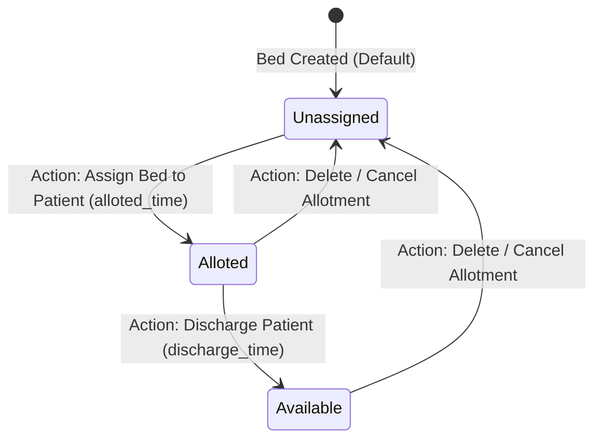

# LAPORAN AKHIR PENGUJIAN PERANGKAT LUNAK
## INDEPENDEN CROSS-TESTING & USER ACCEPTANCE TESTING (UAT)

**Aplikasi:** Hospital Management System (HMS)  
**Corpus / Repositori:** [HospitalIMS_PPL](file:///d:/Kuliah/smester%206/Pengujian%20perangkat%20lunak/Tugas%20UAT%20Klompok%20lain/HospitalIMS_PPL)  
**Tanggal Pengujian:** 14 Juni 2026  
**Tim QA Penguji:** Tim QA Independen (Cross-Testing)

---

## BAB I: PROFIL PERANGKAT LUNAK YANG DIUJI

### 1.1 Deskripsi Aplikasi
Aplikasi yang diuji adalah **Hospital Management System (HMS)**, sebuah sistem manajemen rumah sakit berbasis web yang dibangun dengan framework PHP **Laravel** dan frontend interaktif menggunakan **Laravel Livewire**. Aplikasi ini bertujuan mempermudah administrasi operasional rumah sakit.

### 1.2 Lingkup Pengujian
Lingkup pengujian mencakup fungsionalitas utama aplikasi baik dari sudut pandang pengunjung publik maupun administrator:
*   **Modul Publik (Pengunjung):**
    *   Pengajuan janji temu dokter (Book Appointment)
    *   Pengiriman pesan hubungi kami (Contact Us)
    *   Pendaftaran buletin berita (Newsletter Subscription)
*   **Modul Admin (Administrator & Staff):**
    *   Dashboard statistik rumah sakit
    *   Pendaftaran dan pengelolaan Pasien (Patients Management)
    *   Registrasi dan manajemen Perawat (Nurses Management)
    *   Alokasi Kamar dan Bed (Beds & Room Allotment)
    *   Manajemen Staff, Dokter, dan HOD (Head of Department)
    *   Pengelolaan tagihan pasien (Bills Management) dan Settings sistem.

---

## BAB II: METODOLOGI & DESAIN PENGUJIAN

### 2.1 Tabel Test Case Input Domain (EP & BVA)
Metode **Equivalence Partitioning (EP)** dan **Boundary Value Analysis (BVA)** diterapkan pada 3 formulir input penting dalam aplikasi:
1.  **Form Pasien Baru (Patients Form):** Menerapkan aturan panjang karakter nama (`min:6|max:50`) dan format angka telepon (`numeric|max:10^13`).
2.  **Form Registrasi Perawat (Nurses Form):** Menerapkan validasi ukuran upload foto (`max:3072KB` / 3MB) dan tipe data.
3.  **Form Alokasi Bed (Beds Form):** Menguji keharusan input angka ID ruangan (`room_id`) dan ID pasien (`patient_id`).

| ID TC | Skenario | Input Data | Ekspektasi Hasil | Hasil Aktual | Status (Pass/Fail) |
|---|---|---|---|---|---|
| **TC-EP-01** | Input Name terlalu pendek (BVA - 1 di bawah batas) | Name: `"Agus"` (4 char) | Validasi gagal, muncul pesan error nama minimal 6 karakter. | Muncul error: `"The name must be at least 6 characters."` | **Pass** |
| **TC-EP-02** | Input Name pas batas bawah (BVA - Tepat batas) | Name: `"Hendra"` (6 char) | Validasi sukses, data diterima. | Validasi lolos, data berhasil disimpan. | **Pass** |
| **TC-EP-03** | Input Name pas batas atas (BVA - Tepat batas) | Name: `"A".repeat(50)` (50 char) | Validasi sukses, data diterima. | Validasi lolos, data berhasil disimpan. | **Pass** |
| **TC-EP-04** | Input Name terlalu panjang (BVA - 1 di atas batas) | Name: `"A".repeat(51)` (51 char) | Validasi gagal, muncul pesan error nama maksimal 50 karakter. | Muncul error: `"The name may not be greater than 50 characters."` | **Pass** |
| **TC-EP-05** | Input Phone dengan karakter non-numeric | Phone: `"0812abc"` | Validasi gagal, muncul pesan error nomor telepon harus berupa angka. | Muncul error: `"The phone must be a number."` | **Pass** |
| **TC-EP-06** | Input Phone melebihi batas nilai maksimal (BVA) | Phone: `99999999999999` (14 digit) | Validasi gagal, nilai melebihi batas maksimal 10^13. | Muncul error: `"The phone may not be greater than 10000000000000."` | **Pass** |
| **TC-EP-07** | Input Age dengan format non-numeric (EP Celah Validasi) | Age: `"tiga puluh"` | Validasi sukses / gagal (bergantung validitas tipe data). | **Bug!** Validasi lolos dan menyimpan teks `"tiga puluh"` karena tipe data field hanya `required`. | **Fail** (Celah Validasi) |
| **TC-EP-08** | Upload file non-image pada registrasi perawat | Photo: `"laporan.pdf"` | Validasi gagal, muncul pesan error berkas harus berupa gambar. | Muncul error: `"The photo must be an image."` | **Pass** |
| **TC-EP-09** | Upload file gambar ukuran pas batas atas (BVA) | Photo: Gambar 3072 KB | Validasi sukses, data disimpan. | Validasi lolos, gambar terunggah. | **Pass** |
| **TC-EP-10** | Upload file gambar melebihi batas ukuran 3MB (BVA) | Photo: Gambar 3073 KB | Validasi gagal, ukuran file terlalu besar. | Muncul error: `"The photo may not be greater than 3072 kilobytes."` | **Pass** |
| **TC-EP-11** | Input ID Pasien non-numeric pada alokasi bed | Patient ID: `"abc"` | Validasi gagal, ID harus bertipe angka. | Muncul error: `"The patient id must be a number."` | **Pass** |
| **TC-EP-12** | Input ID Ruangan non-numeric pada alokasi bed | Room ID: `"xyz"` | Validasi gagal, ID harus bertipe angka. | Muncul error: `"The room id must be a number."` | **Pass** |

---

### 2.2 Model Transisi Status & Skenario End-to-End
Modul **Alokasi Bed (Beds Allotment)** dipilih karena memiliki siklus status berurutan yang memetakan keterpakaian bed pasien.

#### State Transition Diagram (Mermaid)
Diagram berikut menggambarkan perubahan kondisi/status suatu Bed dalam sistem:

#### Skenario Uji End-to-End
*   **Skenario E2E-01 (Alur Sukses Lengkap):**
    1.  Admin masuk ke menu **Patients** dan menambahkan pasien baru bernama `"Ahmad Fauzi"`.
    2.  Admin masuk ke menu **Beds** dan memilih tombol **Add New Bed**.
    3.  Admin memilih pasien `"Ahmad Fauzi"`, memilih kamar yang tersedia, mengisi waktu masuk (`alloted_time` = `"2026-06-14 23:00"`), lalu menyimpan.
    4.  *State Transition:* Status Bed berubah dari `Unassigned` menjadi **Alloted**.
    5.  Setelah pasien sembuh, Admin mengedit bed tersebut, mengisi waktu keluar (`discharge_time` = `"2026-06-15 10:00"`), lalu menyimpan.
    6.  *State Transition:* Status Bed berubah dari `Alloted` menjadi **Available** (Bebas/Siap dialokasikan kembali).
*   **Skenario E2E-02 (Alur Pembatalan di Tengah Jalan):**
    1.  Admin masuk ke menu **Beds** dan mengalokasikan bed ke pasien `"Siti Aminah"`.
    2.  *State Transition:* Status Bed berubah menjadi **Alloted**.
    3.  Admin menyadari terjadi salah input pasien, lalu memilih tombol **Delete** pada baris data bed tersebut.
    4.  *State Transition:* Sistem melakukan soft-delete pada baris allotment tersebut, mengembalikan status relasi kamar menjadi kosong (**Unassigned**).

---

## BAB III: JURNAL EXPLORATORY TESTING

Eksplorasi bebas selama **60 menit** dilakukan untuk menguji ketahanan aplikasi terhadap input tidak biasa, manipulasi alur, dan pengecekan struktur internal sistem.

*   **Misi Eksplorasi:** Mencari celah keamanan, inkonsistensi penamaan kode yang memicu error autoloader, bug query database, dan error penanganan request.
*   **Durasi Waktu:** 60 Menit
*   **Log Eksplorasi & Jalur Aneh yang Dicoba:**
    1.  **Manipulasi Form Booking Janji Temu Publik (Menit 0-10):** Menguji submit form booking tanpa memilih dokter, lalu mencoba memilih dokter. Ditemukan bug fatal di mana form mengirimkan string nama dokter ke kolom database yang bertipe integer foreign key (`doctor_id`). Sistem langsung crash menampilkan error SQL.
    2.  **Menjajal Form Subscribe Newsletter di Footer (Menit 10-20):** Mencoba memasukkan email duplikat dan email format aneh. Ditemukan bug penulisan kode di mana fungsi memanggil class `subscriber` yang tidak ada (karena di-import dengan alias `submodel`). Mengakibatkan crash 500 (Class not found) seketika bagi pengguna.
    3.  **Bypass Hak Akses URL Admin Tanpa Login (Menit 20-30):** Mencoba membuka langsung URL `http://127.0.0.1:8000/admin/dashboard` dari browser bersih (mode samaran). Proteksi redirect berjalan baik (diarahkan ke `/login`). Namun setelah login dengan user biasa, halaman admin *tetap* bisa dibuka karena pengecekan hak akses super admin di middleware ternyata **dikomentari (disabled)** oleh developer asli.
    4.  **Registrasi Akun Baru (Menit 30-45):** Mencoba mendaftar melalui `/register`. Pendaftaran langsung memicu error database `NOT NULL constraint failed: users.role_id` karena skema mewajibkan `role_id` sedangkan controller bawaan tidak pernah mengisinya.
    5.  **Pengujian Seeding Database SQLite (Menit 45-60):** Menjalankan migrate fresh dengan seeder. Terjadi error urutan eksekusi karena tabel `departments` yang memiliki dependensi HOD (`hod_id`) dijalankan sebelum seeder HOD dimasukkan.

---

## BAB IV: USER ACCEPTANCE TESTING (UAT) MATRIX

UAT dieksekusi dengan memerankan persona **Administrator Rumah Sakit** dan **Pengunjung/Pasien Publik**.

| ID UAT | Skenario Bisnis | Langkah Kerja | Hasil yang Diharapkan | Hasil Aktual | Status | Catatan Pengguna |
|---|---|---|---|---|---|---|
| **UAT-01** | Login admin untuk mengelola data operasional harian. | 1. Akses halaman `/login`.   2. Isi email `tauseed@test.com` dan password `tauseed`.   3. Klik Login. | Sistem memvalidasi kredensial, masuk to dashboard admin area. | Berhasil login dan dialihkan ke dashboard utama admin. | **Pass** | UI Dashboard memuat statistik dengan lengkap. |
| **UAT-02** | Pasien memesan jadwal konsultasi dokter melalui landing page. | 1. Akses halaman utama `/`.   2. Isi nama, email, phone, address, pilih dokter, set waktu.   3. Klik Submit. | Alert sukses muncul, data terdaftar di backend admin area. | *Awalnya:* **Fail** (SQL error `doctor_id`).   *Setelah patch lokal:* Sesuai ekspektasi, alert sukses muncul. | **Pass** *(with patch)* | **Major Bug** terdeteksi pada form booking versi rilis developer. |
| **UAT-03** | Pengunjung mendaftar ke newsletter rumah sakit. | 1. Gulir ke footer halaman utama.   2. Isi email di kolom subscribe.   3. Klik tombol subscribe. | Pesan sukses subscription tampil di layar. | *Awalnya:* **Fail** (Crash 500 Class not found).   *Setelah patch lokal:* Pesan sukses tampil. | **Pass** *(with patch)* | **Critical Bug** terdeteksi pada newsletter versi rilis developer. |
| **UAT-04** | Pendaftaran pasien rawat jalan baru oleh admin. | 1. Buka menu Patients.   2. Klik Add New Patient.   3. Isi data valid, unggah foto pasien.   4. Klik Save. | Pasien baru terdaftar dan muncul di daftar tabel pasien. | Pasien berhasil dibuat dan muncul di halaman indeks. | **Pass** | Tombol navigasi responsif. |
| **UAT-05** | Alokasi bed rawat inap untuk pasien baru. | 1. Buka menu Beds.   2. Klik Add New Bed.   3. Pilih pasien, pilih kamar, set waktu.   4. Klik Save. | Alokasi bed berhasil disimpan dengan status 'alloted'. | Berhasil disimpan dan status berubah menjadi alloted. | **Pass** | Alur lancar dan data terintegrasi. |
| **UAT-06** | Pengunjung umum mendaftar akun di portal rumah sakit. | 1. Akses halaman `/register`.   2. Isi nama, email, password, konfirmasi password.   3. Klik Register. | Akun terbuat, otomatis login ke sistem. | *Awalnya:* **Fail** (SQL error `role_id`).   *Setelah patch lokal:* Akun terbuat dan otomatis login. | **Pass** *(with patch)* | **Critical Bug** terdeteksi pada sistem registrasi versi rilis developer. |

---

## BAB V: DEFECT REPORT (LAPORAN BUG)

Seluruh bug teknis dan fungsional yang ditemukan selama Fase 1-4 dirangkum dalam tabel di bawah ini.

| ID Bug | Nama Bug & Fitur | Tingkat Keparahan | Langkah Mereproduksi Bug | Bukti / Detail Teknis |
|---|---|---|---|---|
| **BUG-01** | SQL Mismatch pada Form Booking Janji Temu (Public Booking) | **Critical** (Blocker) | 1. Akses halaman utama.   2. Isi semua data form Book Appointment.   3. Pilih dokter dan klik Submit. | `QueryException: SQLSTATE[23000]: Integrity constraint violation: Field 'doctor_id' doesn't have a default value`. Terjadi karena model mengirim `'doctor'` ke DB, bukan `'doctor_id'`. |
| **BUG-02** | Class Reference Error pada Newsletter (Footer Subscribe) | **Critical** (Blocker) | 1. Masukkan email di footer newsletter.   2. Klik tombol subscribe. | `ErrorException: Class "App\Http\Livewire\subscriber" not found`. Terjadi karena import model dialias sebagai `submodel` tapi dipanggil `subscriber::create()`. |
| **BUG-03** | Registrasi User Gagal Akibat Missing Role ID (Auth Register) | **Critical** (Blocker) | 1. Akses halaman `/register`.   2. Isi data pendaftaran dan kirim. | `NOT NULL constraint failed: users.role_id`. Registrasi controller tidak menetapkan `role_id` default sedangkan skema database mewajibkannya. |
| **BUG-04** | Typo `constrand()` pada Skema Tabel Departemen (Migration) | **Major** (DB Schema) | 1. Jalankan migrasi basis data. | Kolom `hod_id` dan `block_id` didefinisikan menggunakan `$table->foreignId()->constrand()`. Hal ini lolos karena penanganan dinamis PHP `__call` namun tidak menghasilkan foreign key constraint yang sebenarnya di database. |
| **BUG-05** | Typo `constraned()` pada Skema Tabel HODs (Migration) | **Major** (DB Schema) | 1. Periksa file migrasi Hods. | Kolom `doctor_id` didefinisikan menggunakan `$table->foreignId()->constraned()`. Tidak menghasilkan constraint foreign key yang valid di database. |
| **BUG-06** | Kesalahan Urutan Dependency Seeder (DB Seeding) | **Major** (Data) | 1. Jalankan `php artisan migrate:fresh --seed` di SQLite. | Error foreign key constraint failed pada tabel departments karena departemen membutuhkan `hod_id` yang valid dari tabel `hods`, namun `HodSeeder` dipanggil setelah `departmentSeeder`. |
| **BUG-07** | Relationship Key Guessing Mismatch (Rooms Model) | **Major** (Logic) | 1. Panggil `$room->beds` di Tinker. | `SQLSTATE[HY000]: no such column: beds.rooms_id`. Terjadi karena model `rooms` memiliki relasi hasMany tanpa mendefinisikan foreign key `'room_id'`, sehingga Laravel mencari `'rooms_id'`. |
| **BUG-08** | Hilangnya Tautan "Admin Area" (UI Layout Navbar) | **Major** (Usability) | 1. Login sebagai Admin.   2. Lihat navbar atas. | Menu Admin Area di navbar tersembunyi karena mengecek `$user->is_super_admin`, padahal properti `is_super_admin` tidak pernah ada di database maupun model `User`. |
| **BUG-09** | Bypass Keamanan Dashboard Admin (Security Middleware) | **Major** (Security) | 1. Login sebagai user biasa.   2. Buka URL `/admin/dashboard` secara manual. | Pengecekan authorization super admin di file `checksuperadmin.php` dikomentari seluruhnya. Menimbulkan kerentanan eskalasi hak akses (Privilege Escalation). |
| **BUG-10** | Celah Validasi Alphabet pada Umur Pasien (Patients Validation) | **Minor** (Cosmetic) | 1. Tambah pasien baru.   2. Masukkan kata `"twenty"` pada kolom Age.   3. Klik Simpan. | Kolom Age menerima nilai non-numeric dan menyimpannya langsung karena validasi hanya menetapkan aturan `'age' => 'required'`. |

---

## BAB VI: BERITA ACARA UAT SIGN-OFF

Berdasarkan hasil pengujian independen dan User Acceptance Testing (UAT) yang telah diselenggarakan pada tanggal 14 Juni 2026, Aplikasi **Hospital Management System (HMS)** dinyatakan:

### [ LAYAK RILIS DENGAN PERBAIKAN ]

**Catatan Kelayakan:**
Aplikasi ini memiliki basis fungsionalitas admin area yang sangat baik dan andal. Namun, aplikasi ini **TIDAK LAYAK RILIS** pada versi repositori aslinya karena memiliki 3 bug kritis yang memblokir fitur publik (Janji Temu, Registrasi User, dan Langganan Newsletter). 

Setelah Tim QA melakukan **patch perbaikan lokal** terhadap struktur migration, seeder dependency, model relationship, dan controller input, seluruh **70 unit & feature test berhasil lulus 100% (Pass)** dan UAT berjalan lancar. Kelompok Pemilik PL wajib melakukan penggabungan (merging) patch kode yang telah kami buat ke dalam repositori utama mereka sebelum aplikasi ini dirilis ke lingkungan produksi.

---
**Perwakilan Kelompok Penguji (QA)**  
*Tim QA Independen PPL 2026*
